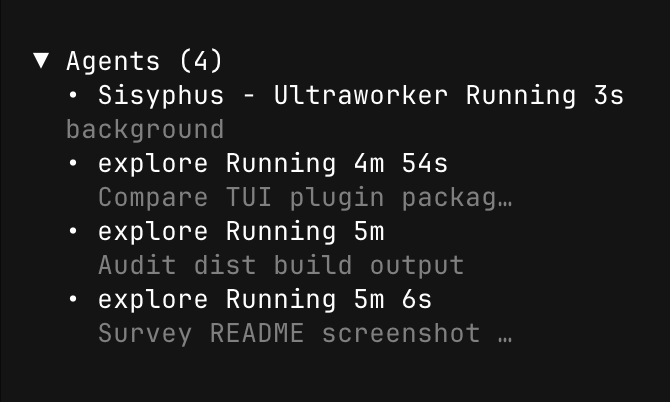

# @psh4607/opencode-agent-sidebar

OpenCode TUI plugin that surfaces real-time sub-agent activity in the sidebar — see what every delegated `task` / `delegate` is doing, with a live elapsed timer that actually ticks.

> **Why?** OpenCode lets you fan out work to sub-agents (`oracle`, `explore`, `librarian`, your own custom agents, background `delegate(...)` jobs, etc.). Out of the box you can't see what's currently running. This plugin adds a tiny "Agents" section to the sidebar so you always know.

---

## Preview

<p align="center">
  
  

</p>

Live sidebar showing the active main agent plus three foreground `explore` sub-agents with elapsed timers. Click the `▼ / ▶` header anywhere on the row to collapse, or use the `/agents-toggle` slash command (`Ctrl+x a`). Live entries show `Running`; completed ones linger ~3s with `Done` / `Error` before fading.

---

## Features

- **Live elapsed timer** — Solid.js signal-driven, the seconds actually tick up every second (no waiting for the next event).
- **Foreground vs background separation** — native `task(background=true)` and `delegate(...)` jobs are grouped separately from synchronous `task(...)` calls; the older `run_in_background` field remains supported.
- **Main agent visibility** — the assistant's own turn appears only while its session is busy or retrying.
- **Per-session filtering** — only shows agents from the currently focused sidebar session.
- **Auto-cleanup** — completed entries fade after about 3 seconds; nothing accumulates forever.
- **Collapsible** — toggle via slash command `/agents-toggle` or keybind `Ctrl+x a`. State persists across restarts.
- **Update notifier** — once a day the sidebar header shows `[⬆ vX.Y.Z available]` if a newer GitHub release exists. Read-only — never self-updates.
- **Zero config** — drop it in your plugin list and restart.

---

## Requirements

- **OpenCode** v1.14.39 or newer (TUI plugin slots and reactive state APIs).
- **Bun** (OpenCode runs on Bun; no separate runtime needed).

---

## Install

### Option A — From GitHub (recommended for now)

Add the GitHub spec to your OpenCode config. Edit `~/.config/opencode/opencode.json` (or `~/.config/opencode/tui.json`) and append to the `plugin` array. **Pinning to a tag is recommended** — see [Updating](#updating) below for why:

```json
{
  "$schema": "https://opencode.ai/config.json",
  "plugin": [
    "github:psh4607/opencode-agent-sidebar#v0.2.0"
  ]
}
```

Or, to track the latest `main` (manual cache deletion required to upgrade — see [Updating](#updating)):

```json
{
  "plugin": [
    "github:psh4607/opencode-agent-sidebar"
  ]
}
```

Then restart the TUI:

```bash
opencode
```

### Option B — From a local checkout (for development)

```bash
git clone https://github.com/psh4607/opencode-agent-sidebar.git
cd opencode-agent-sidebar
bun install
bun run build
```

Point your config at the local path:

```json
{
  "plugin": [
    "file:/absolute/path/to/opencode-agent-sidebar"
  ]
}
```

### Option C — From npm (future)

Not yet published to the npm registry. When it lands:

```bash
# Add to opencode.json plugin array as:
#   "@psh4607/opencode-agent-sidebar"
```

---

## Configuration

No config file needed. The plugin exposes one toggle:

| Action | Slash command | Keybind |
| --- | --- | --- |
| Show / hide the Agents panel | `/agents-toggle` | `Ctrl+x a` |

State is persisted to OpenCode's KV store (`agents-panel.collapsed`) and survives restarts.

---

## Updating

OpenCode caches plugins indefinitely under `~/.cache/opencode/packages/<spec>/` once installed; there is **no automatic update path**. To pick up a new version you must either change the spec to a newer tag or manually clear the cache.

### Option 1 — Pin to a tag (recommended)

Edit your `opencode.json` plugin entry to bump the tag suffix:

```diff
- "github:psh4607/opencode-agent-sidebar#v0.1.0"
+ "github:psh4607/opencode-agent-sidebar#v0.2.0"
```

Restart OpenCode. Each tag has its own cache directory, so the new version is fetched cleanly without touching the old one.

### Option 2 — Track latest `main`

If your spec is the bare `github:psh4607/opencode-agent-sidebar` (no tag), upgrading requires a manual cache delete:

```bash
rm -rf ~/.cache/opencode/packages/'github:psh4607:opencode-agent-sidebar'*
```

If your shell expands the path differently, this fallback works on any layout:

```bash
find ~/.cache/opencode/packages -maxdepth 1 -name '*psh4607*' -exec rm -rf {} +
```

Then restart OpenCode. The plugin is re-fetched from `main`.

### Why `opencode plugin -f` does not work

As of OpenCode v1.14.x, `opencode plugin <spec> -f` only rewrites your `opencode.json` config — it does **not** refresh the cached plugin code. If you've already loaded the plugin once, `-f` will leave the old version in place. Use one of the two options above instead.

---

## How it works

The panel derives each snapshot from OpenCode's reactive message, part, and session-status state. Rows originate only from real `task` / `delegate` tool parts, so persistent `subtask` command metadata and `agent` prompt mentions cannot become false running work. Removing a tool part removes its row on the next reactive update without depending on an event payload shape.

Native background Task rows follow their `metadata.sessionId` / `metadata.jobId` child session through busy, retry, and idle states even after the parent tool call completes. Resumed invocations are deduplicated immediately through `input.task_id`, before refreshed child metadata arrives. Existing OMO/legacy `delegate`, `run_in_background`, `backgroundTaskId`, output-ID, and background-reminder formats remain supported, but their reminders only update rows that originated from a real tool part.

Internally the panel is built with [`@opentui/solid`](https://github.com/anomalyco/opentui) using Solid signals. A `now` signal ticks every second for elapsed durations, while a small lifecycle tracker preserves queued start times and terminal transitions for the three-second retention window.

No JSX is used; the renderer is invoked via `createElement` / `setProp` / `insert` from `@opentui/solid` so no Babel/JSX transform pipeline is required at install time.

---

## Compatibility

| Plugin version | OpenCode |
| --- | --- |
| `0.2.x` | `>= 1.14.39` |
| `0.1.x` | `>= 1.14.39` |

If you're on an older OpenCode, the TUI plugin slot system (`sidebar_content`) and reactive state APIs may differ; please open an issue.

---

## Development

```bash
bun install
bun run test        # deterministic lifecycle regression tests
bun run typecheck   # tsc --noEmit
bun run build       # tsc → dist/
```

While iterating, point your OpenCode config at the local path (Option B above) and restart the TUI to pick up changes. There is currently no hot-reload; the plugin must be re-loaded on TUI startup.

### Project layout

```
src/
  agent-sidebar-state.ts  # pure lifecycle and compatibility helpers
  server.ts               # no-op server-side plugin (keeps oc-plugin contract happy)
  tui.ts                  # the actual sidebar logic
test/
  agent-sidebar-state.test.ts
dist/         # built output (committed so `github:` installs are zero-config; regenerate via `bun run build`)
```

### Pull requests

Please run `bun run test`, `bun run typecheck`, and `bun run build` before submitting. Keep changes minimal and focused — bug fixes shouldn't bring along unrelated refactors.

---

## License

[MIT](./LICENSE) © Seongho Bak
